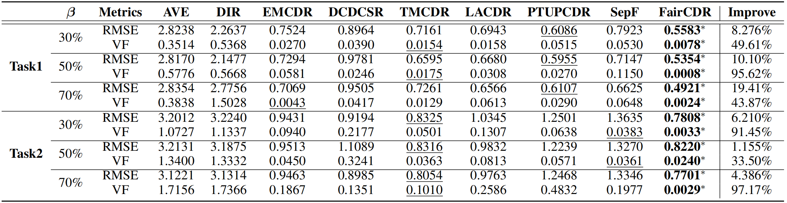

# 1. Abstract

Cross-Domain Recommendation (CDR) is an effective approach for mitigating the cold-start problem. However, previous research largely overlooks the issue of fairness: undesired bias associated with sensitive attributes in CDR scenarios. Specifically, through our data-driven experiments, we find that existing CDR-based methods are particularly vulnerable to the distribution bias in sparse cross-domain data, and this bias easily results in unfair treatment of cold-start users in the target domain, eventually exacerbating the recommendation feedback loop. Additionally, most fairness-aware recommendation algorithms mainly focus on scenarios where unfairness arises during the ''warm-start'' phase. However, there is a dearth of research dedicated to addressing user unfairness during the ''cold-start'' phase. To tackle the above problems, in this paper, we propose a novel fairness-aware algorithm for CDR, called FairCDR. Specifically, FairCDR granularly models the individual influence of each sample on both fairness and accuracy to facilitate data reweighting, effectively striking a balance between fairness and recommendation utility. To further mitigate the issues of data sparsity and bias, we design an interaction-augmented mapping function. In particular, FairCDR generates proxy users for warm-start users in the target domain who do not overlap with the source domain. This enables the recommender model to utilize the rich knowledge of well-represented users to learn the high-quality mapping function for cold-start users. Extensive experiments are conducted to demonstrate the effectiveness of our proposed method.

# 2. Contributions

- We use real-world dataset to empirically analyze the user unfairness problems in cross-domain recommendation. We argue that improving fairness for cold-start users in the target domain is essential to the entire lifecycle of recommender system. To our best knowledge, we are the first to study the group fairness of cold-start users in cross-domain recommendation.
- We propose a simple but effective fairness-aware cross-domain recommendation framework, namely FairCDR, which effectively and efficiently improves the fairness of cold-start users without sacrificing accuracy.
- Extensive experiments conducted on real-world CDR tasks demonstrate the effectiveness and superiority of our proposed FairCDR.

# 3. Dataset Information

<center>Table 1: Statistics of the datasets used in our experiments.</center>
<div align=center></div>

We process raw data for **Tenrec-QB** dataset based on the following strategy:

- For QB-video:
  - filter the videos that watching_times == 0.
  - let `raing = min(5, click+follow+like+share+watching_times)`.
- For QB-article:
  - filter the article whose read_percentage == 0.
  - set rating as **5** (if read_percentage >= 80), as **4** (if 80 > read_percentage >= 60), as **3** (if 60 > read_percentage >= 40), as **2** (if 40 > read_percentage >= 20), as  as **1** (if 20 > read_percentage > 0). The key processing code is shown as follows:
    ```python
    target_df['rating'] = 5.0 
    mask = [True]*len(target_df)
    mask &= (target_df['read_percentage']<80.0) 
    target_df.loc[mask, 'rating'] = 4.0
    mask &= (target_df['read_percentage']<60.0) 
    target_df.loc[mask, 'rating'] = 3.0
    mask &= (target_df['read_percentage']<40.0) 
    target_df.loc[mask, 'rating'] = 2.0
    mask &= (target_df['read_percentage']<20.0) 
    target_df.loc[mask, 'rating'] = 1.0
    ```
- For QB-users:
  - remove the users whose gender is unknown, i.e., gender == 0.

We process raw data for **Tenrec-QK** dataset based on the following strategy:

- For QK-video:
  - filter the videos that watching_times == 0.
  - let `raing = min(5, click+follow+like+share+watching_times)`.
- For QK-article:
  - filter the article whose read_percentage < 3.
  - filter the article whose read == False.
  - filter the article whose read_time < 3.
  - set rating as **5** (if favorite==1 or read_percentage >= 80 or share+like+follow >= 2 or (if share+like+follow=1 and read_percentage>=60)), as **4** (if share+like+follow=1 or 80 > read_percentage >= 60), as **3** (if 60 > read_percentage >= 40), as **2** (if 40 > read_percentage >= 20), as **1** (if 20 > read_percentage > 0). The key processing code is shown as follows:
    ```python
    target_df['rating'] = 5
    mask = [True]*len(target_df)
    mask &= ~(target_df['favorite']==1)
    mask &= ~(target_df['read_percentage']>=80)
    mask &= ~(target_df['share']+target_df['like']+target_df['follow']>=2)
    mask &= ~((target_df['share']+target_df['like']+target_df['follow']==1) & (target_df['read_percentage']>=60))
    target_df.loc[mask, 'rating'] = 4
    mask &= ~((target_df['share']+target_df['like']+target_df['follow']==1) | (target_df['read_percentage']>=60))
    target_df.loc[mask, 'rating'] = 3
    mask &= ~(target_df['read_percentage']>=40)
    target_df.loc[mask, 'rating'] = 2
    mask &= ~(target_df['read_percentage']>=20)
    target_df.loc[mask, 'rating'] = 1
    ```
- For QK-users:
  - remove the users whose gender is unknown, i.e., gender == 0.

# 4. DownLoad

[Datasets and Code](https://drive.google.com/file/d/16yCh9DgzUKO3hnqRDdYTP0FFVmZar8pB/view?usp=sharing)

# 5. Main Results

<center>Table 2: Overall comparison between the baselines and our models.</center>
<div align=center></div>

# 6. Code Description

- raw-data: Tenrec-QB and Tenrec-QK raw datasets
- data-code: process the raw-data
- log: store the logging files when training models
- model_cpt: store the best checkpoint of models
- tensorboard: store the tensorboard event files for visualization
- wandb: store the temp fils when using wandb to tune parameters

# 7. Usage

1. Download the code and datasets.
2. Process the raw data. You can change the beta and other parameters in the "data-code/QB_process_data.py" or "data-code/QK_process_data.py". Note that we will generate a distinct id for every model so that we can reuse the model.

```shell
      python data-code/QB_process_data.py
      python data-code/QK_process_data.py
```

3. Pretrain the user and item embeddings for the source domain and the target domain, respectively.

```shell
      python model-code/pretrain/quick_start.py --model MF --learning_rate 0.01 --embedding_size 128 --weight_decay 0.000001 --optimizer_type adam --init normal --data_type 'QB' --data_domain 'source' --beta 0.3 --use_tensorboard --use_gpu --gpu_id 0 --log --saved

      python model-code/pretrain/quick_start.py --model MF --learning_rate 0.01 --embedding_size 128 --weight_decay 0.000001 --optimizer_type adam --init normal --data_type 'QB' --data_domain 'target' --beta 0.3 --use_tensorboard --use_gpu --gpu_id 0 --log --saved
```

4. Train the FairCDR without weights to init the model.

```shell
      python model-code/faircdr/quick_start.py --learning_rate 0.01 -bs 128 --simK 3 --gamma 1.0 --tau 1.0 --lamb 0.5 --alpha 1.0 --weight_decay 0.000001 --optimizer_type adam --init normal --data_type 'QB' --beta 0.3 --use_tensorboard --use_gpu --gpu_id 0 --log --saved --source_id your_source_id --target_id your_target_id --pretrain_model MF 
```

5. Calculate the influence scores for CDR data with model trained in 4.

```shell
      python model-code/calculate-weight/quick_start.py --data_type 'QB' --beta 0.3 --damp 0.01 --scale 25 --batch_size 128 --recursion_depth 1000 --faircdr_id your_faircdr_id --use_gpu --gpu_id 0 --pretrain_model MF
```

6. Retrain the FairCDR with IF-based reweights

```shell
      python model-code/faircdr/quick_start.py --learning_rate 0.01 -bs 128 --simK 3 --gamma 1.0 --tau 1.0 --lamb 0.5 --alpha 1.0 --weight_decay 0.000001 --optimizer_type adam --init normal --data_type 'QB' --beta 0.3 --use_tensorboard --use_gpu --gpu_id 0 --log --saved --source_id your_source_id --target_id your_target_id --pretrain_model MF --weight_method IF --damp 0.01 --scale 25 --batch_size 128 --recursion_depth 1000
```

# 8. Detailed parameter search ranges

We fixed the embedding size as 128. The batch sizes are set 128. The search ranges of hyper-parameters are listed as follows.

| Hyper Parameters | Tuning range                    |
| :--------------: | :------------------------------ |
|   weight_decay   | {0,1e-6,1e-5,1e-4}              |
|  learning_rate  | {0.00001,0.0001,0.001,0.01,0.1} |
|       lamb       | {0.1,0.3,0.5,0.7,0.9}           |
|  optimizer_type  | {'adam', 'sgd'}                 |
|       init       | {'normal', 'uniform'}           |
|       simK       | {1,3,5,10,15,20}                |
|      gamma      | {25,10,5,1,0.5,0.1,0.01}        |
|       tau       | {25,10,5,1,0.5,0.1,0.01}        |
|    activation    | {'relu','tanh'}                 |

# 9. Runtime Environment

- System: Linux, 20.04.1-Ubuntu
- CPU: Intel(R) Xeon(R) Gold 5318Y CPU @ 2.10GHz
- CPU-Memory: 512G
- GPU: NVIDIA A40(45G)
- Pytorch: torch-1.9.0+cu111
